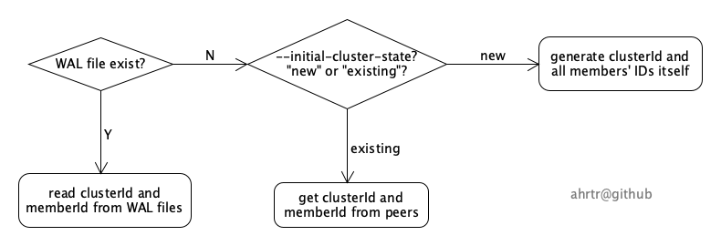

cluster ID mismatch
======
# Background
Many etcd users raised the question of why etcd complains "cluster ID mismatch", and how to resolve it. For example,  
[etcd/issues/11562](https://github.com/etcd-io/etcd/issues/11562)  
[etcd/issues/11642](https://github.com/etcd-io/etcd/issues/11642)   
[etcd/issues/12361](https://github.com/etcd-io/etcd/issues/12361)  
[etcd/issues/13453](https://github.com/etcd-io/etcd/issues/13453)  

This article will answer this question. 

# How is the cluster ID generated?
The first thing is that you need to understand how is the cluster ID generated. It is clearly depicted in the following diagram,

Firstly, etcd checks whether the local WAL files exist or not. If yes, then it loads both the clusterId and memberId from the WAL files directly. Of course, it will also load all members' info from the backend db file later. 

Secondly, if there is no any local WAL file, then etcd checks the command-line flag "--initial-cluster-state". If its value is "existing", then it will try to get the cluster info from peers, including clusterId and each member's info, such as memberId and peerURLs. It applies to the case of adding a new member into an existing cluster. Actually the member's ID was generated by one of the existing members when joining the new member into the existing cluster.

If the "--initial-cluster-state" is "new", then etcd generates the cluster ID and all members' IDs itself. Each member's ID is decided by it's peerURLs and the value of flag "--initial-cluster-token". The cluster ID is decided by all members' IDs. In this case, each etcd instance must start with exactly the same "--initial-cluster" and "--initial-cluster-token" values. Of course, it's also possible to bootstrap a new cluster using discovery, but it isn't in the scope of this article. If you are interested in the detailed implementation, please take a look at [cluster.go#L83-L97](https://github.com/etcd-io/etcd/blob/4e97271e4ec5b50dffeff31bbfb69fc2f2b28d93/server/etcdserver/api/membership/cluster.go#L83-L97).

# Why does etcd raise this error?
There are three possible reasons.

- You reuse some (instead of all) peer addresses when recreating an etcd cluster. If any etcd instance from the old cluster is trying to connect to the new cluster, then you will see this error (or warning) message in the new cluster.
- You set the flag "--initial-cluster-state" as "new" for a new member after joining it into an existing cluster. Note that one of the existing members generates a memberId for the new member based on its peerURLs and the time at the moment of joining the new member.
- You set different "--initial-cluster" or "--initial-cluster-token" flag values for different etcd instances when starting a new etcd cluster.

# How to resolve it?
Please think about this question yourself based on this article. If you still need help, feel free to raise an issue in this repo.

