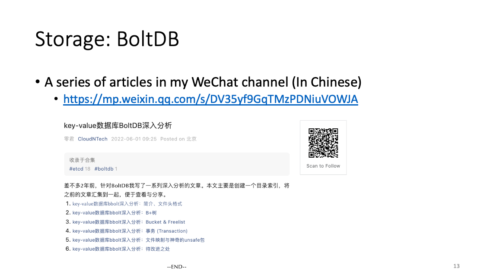
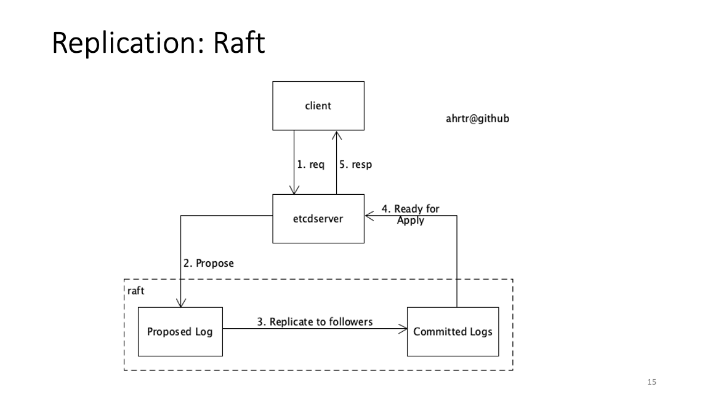

Overview (deep dive) on etcd
======

ahrtr@github  
June 8th, 2022

# Background
I delivered an etcd presentation on CNCF storage tag meeting on June 8th. The recording has already been uploaded to 
Youtube (see link below). Please watch the video starting from 10th minutes.

[https://www.youtube.com/watch?v=D2pm6ufIt98&t=927s](https://www.youtube.com/watch?v=D2pm6ufIt98&t=927s)

I just paste each PPT slide and add some description for each slice.

# Table of Contents
- **[Self introduction](#self-introduction)**
- **[etcd architecture and components](#etcd-architecture-and-components)**
  - [Introduction to etcd](#introduction-to-etcd)
  - [Architecture](#architecture)
  - [Storage (WAL, snapshot and BoltDB)](#storage-wal-snapshot-and-boltdb)
  - [Storage: WAL (Write Ahead Log)](#storage-wal-write-ahead-log)
  - [Storage: WAL file format](#storage-wal-file-format)
  - [Storage: tool to analyze WAL file](#storage-tool-to-analyze-wal-file)
  - [Storage: snapshot (v2)](#storage-snapshot-v2)
  - [Storage: BoltDB](#storage-boltdb)
  - [Storage: BoltDB feature](#storage-boltdb-feature)
  - [Storage: tools to analyze BoltDB file](#storage-tools-to-analyze-boltdb-file)
  - [Storage: more info on BoltDB](#storage-more-info-on-boltdb)
  - [Replication: Raft](#replication-raft)
  - [Replication: Raft workflow](#replication-raft-workflow)
  - [Etcdserver](#etcdserver)
  - [Client Package](#client-package)
  - [Put e2e workflow](#put-e2e-workflow)
- **[What's the etcd community working on?](#what-is-the-etcd-community-working-on)**
- **[Q & A](#q--a)**

# Self Introduction

Just one thing to highlight, my github account is ahrtr. It's the acronym of Ad-hod Real Time Reporting, which is 
one of the projects I did many years ago. 

# etcd architecture and components

## Introduction to etcd

There are two key points. The first key point is it's a key-value database. It means it isn't a relational database.
Instead, it's a kind of No-SQL database.

The second key point is strong consistency. Based on CAP theory, no any system can achieve all of the three goals,
nor can etcd. etcd is actually a CP system, it sacrifices availability at the interest of consistency. It can't serve
write request if the quorum isn't satisfied. 

etcd can't serve linearizable read request by default if the quarum isn't satisfied. But etcd can serve serializable 
read request even when the quorum isn't satisfied.

## Architecture

This diagram describes the high-level architecture of etcd. Etcdserver is the most important component, and it gets all other components connected.

The client can be the command line tool etcdctl, or a client application depending on the etcd client go SDK. In this diagram, it uses etcdctl as the example. 
The client sends requests to gRPC server, and the gRPC server delegates all requests to etcdserver.

You know, the request may be read or write request. For write request, it needs to get consensus from majorities. So etcdserver gets the request wrapped in a proposal, 
and deliver it to the raft. Raft will take care of the log replication. Once the log has already been received by majority of the members, then raft marks the log as 
committed, and notify the etcdserver the log is ready for apply.

Afterwards, etcdserver performs the apply workflow. It saves the key-value data to the watchable store. It supports MVCC, which means it keeps all the history of each key. 
The kvstore eventually persists the data into the backend db.

For read requests, it also needs to make sure the current member has already applied all committed log. Simply put, it needs to make sure the current member has the 
latest data as the leader. Once it’s confirmed, it reads data from local store and respond to the client. Otherwise, it needs to wait until the local data catch up to 
the latest commit as the leader.

Of course, if the client issues a serializable read request, then etcdserver will not wait at all, it just reads the data from local store directly.

## Storage (WAL, snapshot and BoltDB)

Etcd has three kinds of storage files, which are WAL, snapshot and boltdb files. On the right side is the layout under the etcd data directory. 
The snapshot files are actually v2 snapshot.

The v3 snapshot is only used for data replication. You know, leader needs to replicate log to followers. But if a follower lags far behind, 
then the leader may replicate the whole db file to the follower. It will generate a v3 snapshot, and send the snapshot to follower in this case.

I will talk about each storage file later.

## Storage: WAL (Write Ahead Log)

Let’s look at the WAL file firstly. WAL file means Write-Ahead Log file. Each WAL file is about 64MB, and only recent 5 WAL files are preserved, it’s configurable.

You know, leader replicates logs or logs to followers using raft. Once each member receives the logs, the first thing is to persist them into WAL files, and append only.

When an etcd member restarts for any reason, the logs in local WAL files starting from the latest snapshot are replayed. So once data are saved in WAL file, they will not be lost. 

## Storage: WAL file format

This diagram is the detailed format of the WAL file. Each WAL file consists of a series of records. The first 8 bytes in each record is the length of the record. 
It’s encoded in little endian, and the record size is actually stored in the lower 56 bits. In order to make sure each record is always 8 bytes alignment, 
there may be some pad bytes. If the MSB(Most significant bit) is 1, then the lower 3 bits in the MSB(Most significant byte) is the pad size.

The record data can be decoded into a struct. The first field is the record type. You can see that there are 5 types. The second field is the CRC checksum. 
The last field is the real data bytes. The data can be further decoded based on the type.

For example, if it’s entry type, then it can be decoded into the struct `raftpb.Entry`. It contains Term, Index, Type and Data. Again, the data can be further decoded based 
on its type. In general, the entry type has two categories, which are normal entries and conf changes. 

## Storage: tool to analyze WAL file

There is a tool etcd-dumps-logs in the etcd project. It can be used to analyze the WAL files. 

## Storage: snapshot (v2)

V2 snapshot file is suffixed with “.snap”. Recent 5 snapshot files are preserved by default, it’s also configurable.

It only contains term, index and membership info. Which means it doesn't contain any key-value data, because v2store data has already been deprecated in 3.4, 
and is already decommissioned in 3.6. The data is still maintained for 3.6 rollback. Eventually they will be gone in future release.

A new snapshot file is automatically generated on every 100K applied logs. If users kick off the cluster downgrade, a new snapshot file will also be generated immediately. 
Once a snapshot is generated, then all WAL logs older than the snapshot index are compacted in raft. 

## Storage: BoltDB

BoltDB is a project under the etcd-io organization, it’s forked from boltdb/bolt. It’s an embedded key/value database, which means it runs as a library in other applications, such as etcd.

It’s the most important storage for etcd, all the key-value data is stored in boltdb. Key-value data is saved in buckets. Bucket is similar to table in relational database, 
it’s just a logic concept.

BoltDb uses B+tree to manage all key-value records. All the data are saved page by page in a disk file.  Usually the page size is 4K.

It has four kinds of page. The branchPage and leafPage are equivalent to the internal-node and leaf node in a B+tree. The first two pages in the file are reserved for metadata, they are metaPages. 
There are maybe some free pages in the file, and the IDs of all the free pages are saved in the freelistPage. 

## Storage: BoltDB feature

The most important feature of BoltDB is that it doesn't modify data in-place! Let’s work with an example. The diagram is coming for my WeChat channel. The original file is missing, 
so I just created a screenshot of the diagram.

For example, if an application updates some data in the leaf page 8. BoltDB loads the leaf page and its ancestors, all the way to the root page, into memory. BoltDB updates the data in memory. 
When client application commits the transaction, boltDB allocates new pages in the disk file and save the updated data into the new pages in disk file. 
Of course, BoltDB will try to get free page from the freePage list if any. Obviously the old pages keep unchanged during the transaction.

Such design has two benefits. The first benefit is the writing transaction doesn't affect any other read transactions. The read transactions can always read the same data during the transaction. 
So it guarantees the repeatable read. The second benefit is that it guarantees atomicity. If the writing transaction fails for whatever reason, it doesn't corrupt any existing data. 
The only side effect is the db file may be enlarged after the transaction. But it shouldn’t be a problem, because new allocated pages can be reused later, and users can also manually reclaim the unused pages. 

## Storage: tools to analyze BoltDB file

There are two tools which can be used to analyze the boltdb file. The first one is etcd-dump-db, it’s included in the etcd project. 
The second is the command line tool provided by the boltDB itself. There are two examples, actually they are doing the similar thing. They are just reading keys from a bucket. 

## Storage: more info on BoltDB 

I wrote a series of articles about 2 years ago in my WeChat channel. Feel free to take a look.

But it’s in Chinese for now. I may provide some summary in English in the future.  

## Replication: Raft

Raft is the key package to achieve consensus between members. Etcd depends on raft to maintain a replicated state machine. If you want to have a deeper understanding, 
I recommend you to read the introduction on the package and read the original pager.

It follows a minimalistic design philosophy. It only implements the core raft algorithm. The storage and network transport are handled by etcd server.

The two main functions provided by raft are leader election and log replication. The member which gets the majority vote is elected as the leader. Only the leader replicates logs to followers.

Etcdserver and raft talk to each other via channels. From raft perspective, there are input channels and output channel. Raft encapsulates the input channels, and expose the Node interface. 
So Etcdserver talks to raft via the Node interface, while raft talks to etcdserver via the output channel.

Actually, raft is a standalone package, you can also develop your own applications based on raft.

## Replication: Raft workflow

The diagram is the high-level workflow of raft. Firstly, a client sends a request to etcdserver, then etcdserver gets the request wrapped in a proposal, and submits the proposal to raft.

IF the current raft node is the leader node, it replicates the log to followers. Once majority receives the log, the leader marks the log as committed, and notify the etcdserver that the logs are ready for apply. 
At last, etcdserver persists the logs and send response back to the client. 

## Etcdserver

Etcdserver is the most important component, and it gets all other components connected. It exposes a gRPC API to receive client requests, and it also has a raft loop to communicate with raft. 
So the requests may be coming from gRPC API or raft.

Etcdserver also starts some jobs, such as the job periodically purge WAL files or snapshot.

Etcdserver also has a Key-value store, which supports multi-version concurrent control. It persists data to backend db file.

## Client package

The client v3 is the official etcd client go SDK. It is a simple example on how to use client v3 package.

Firstly import the client/v3 package. Secondly create a client instance using the construction function `New`, applications need to pass a Config to the constructor. 
Afterwards, applications can call whatever methods they want. In this example, the application call `Put` method to put a key-value pair to etcdserver. At last, close the client instance.

Please note that client/v2 is already decommissioned, so please do not use it. 

## Put e2e workflow

This diagram is a detailed e2e workflow on how etcd processes a put request. Firstly, the client sends a put request to etcdserver. The etcdserver then proposes the request to raft. 
The raft appends the log to its local raftLog, then respond to the etcdserver. But the workflow isn’t finished yet, so etcdserver can’t respond to the client, it watches a channel to 
wait for the workflow to finish.

The leader raft node saves the log into WAL file in the first step. Just I mentioned previously, raft follows a minimalistic design philosophy, the storage and network transport are handled 
by etcdserver. So raft just notifies etcdserver to save the log into WAL file via the ready channel.

In the meanwhile, the raft leader also replicates the log to other followers. Once the leader receives confirmations from majority, including itself, then it marks the log as committed 
by updating the commitID.

Afterwards, the leader raft node notifies the etcdserver that the log is ready for apply. It also replicates the commitID to all followers, so that each follower raft node can also 
notify the corresponding etcdserver to apply the log.

When the etcdserver finishes the applying workflow, it wakes up the waiting goroutine blocked at step 5. Eventually it sends response to the client.

# What is the etcd community working on?

These are some items the community is working on. The items marked with asterisk are the priorities.

The first one is to unify test framework. Etcd has integration test and e2e test. Previously they have separate test frameworks, but actually most integration and e2e test cases have 
the same or similar logic, so we are working to unify the test framework.

The second one is the v3.5 data inconsistency postmortem. The first link is the postmortem of the issue. If you want to have a quick understanding on the issue, I recommend you take 
a look at the second link, which provides a simple summary on the issue. There are some actions items in the postmortem, such as enhance the data corruption detection code and refactor 
etcdserver to make the applying code easy to understand and validate.

The third item is for lease. Some requests do not go through raft. The reason is the raft is based on a global logic clock, while the lease depends on wal time. So there is a gap. 
This item is still in progress of investigation. It’s in my to do list.

The fourth item is for the revision in response header. Just as I mentioned previously, etcdserver supports multi-version concurrent control for the key-value store, 
so it means that revision only makes sense for the key-value data. But currently etcdserver also returns revision in the response header for other request, such as lease.

The next item is to sort out all the min/max thresholds. For example, users can specify the max request size, but in the meanwhile, we hard code the max WAL entry limitation as 10MB. 
So etcd may run into a situation that it successfully processes a request larger than 10MB, but fails to be decoded by WAL package. There are some other examples as well. 
Anyway, we need to get all these sorted out.

The next one is a new feature “Memory aware server side throttle”, it’s developed by a contributor. Sometimes, etcd may crash due to OOM. This feature is to protect etcd from running 
into such situation. I do not get time to have a deep review on the PR yet. Of course, it’s in my to do list.

The last one is “Namesapce Quota feature”, it’s also developed by a contributor. It’s designed to resolve the multi-tenant use case, its high level idea is to isolate the storage for each user, 
and apply different quota on different users. I do not get time to have a closer look at this feature so far, but my immediate feeling is that the better way to resolve multi-tenant use case 
could be just start a dedicated etcd cluster for each user, or let the client application instead of etcd to handle the multi-tenant use case. Anyway, I don’t think this item is a priority for now. 
We may revisit it in the future.

There are also some other items, but we do not get time to take a closer look yet. 

# Q & A

