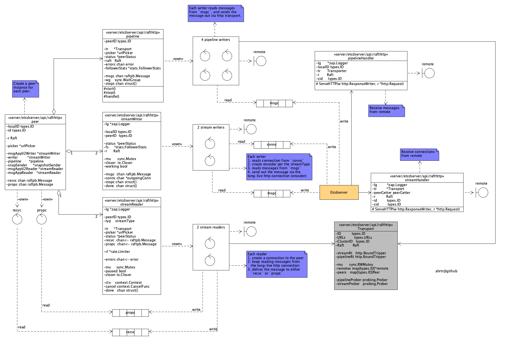

etcd peer to peer communication workflow
======

ahrtr@github  
September 10, 2025

# Introduction
I ended up spending a whole day on this diagram just to answer a question on network communication metrics and clear up my confusion about etcd peer-to-peer communication.
Snapshot sender isn't included, but it's also using the pipeline transport.

