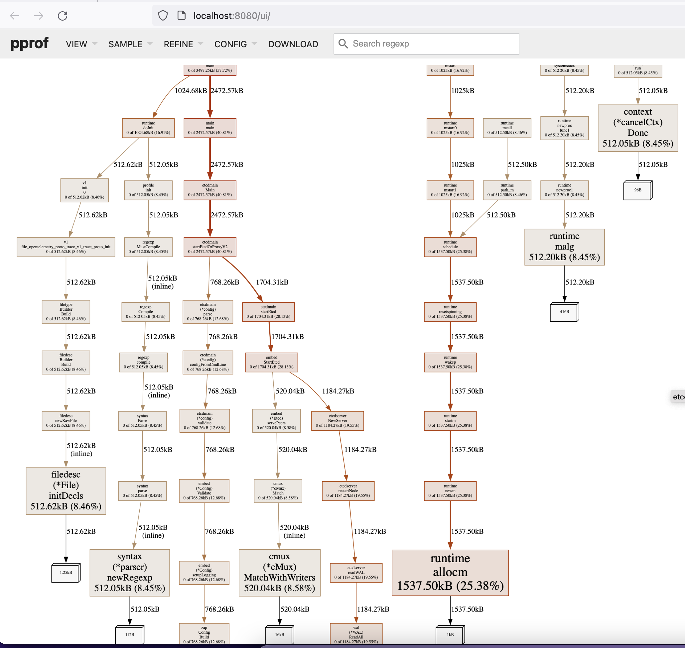

How to debug performance issue?
======
<span style="color: #808080; font-family: Babas; font-size: 1em;">
ahrtr@github <br>
December 23rd, 2022
</span>

# Table of Contents

- **[Background](#backgroundo)**
- **[CPU](#cpu)**
    - [Command `top`](#command-top)
    - [Metrics `process_cpu_seconds_total`](#metrics-process_cpu_seconds_total)
    - [(optional) Investigate CPU bottleneck using pprof](#optional-investigate-cpu-bottleneck-using-pprof)
      - [Preparation](#preparation)
      - [Collect CPU profile](#collect-cpu-profile)
      - [Analyze the CPU profile](#analyze-the-cpu-profile)
- **[Memory](#memory)**
    - [Command `top`](#command-top-1)
    - [Metrics `process_resident_memory_bytes`](#metrics-process_resident_memory_bytes)
    - [(optional) Investigate memory bottleneck using pprof](#optional-investigate-memory-bottleneck-using-pprof)
    - [Note: memory may be related to db file size](#note-memory-may-be-related-to-db-file-size)
- **[Disk I/O](#disk-io)**
    - [fio](#fio)
- **[Network I/O](#network-io)**
- **["apply request took too long"](#apply-request-took-too-long)**
- **[Disk space usage](#disk-space-usage)**
- **[heartbeat-interval and election-timeout](#heartbeat-interval-and-election-timeout)**
- **[Performance optimization](#performance-optimization)**
- **[Next step?](#next-step)**

# Background
Performance issue can be related to CPU, memory, disk/IO, network I/O, disk space usage or some etcd configurations.

This post shows you how to debug performance issues.

# CPU
## Command `top`
The easiest way to check CPU usage is to execute `top`. You can get the overall CPU usage and each process's CPU usage.
```
top - 01:05:28 up 17 days, 17:35,  2 users,  load average: 0.00, 0.00, 0.00
Tasks: 208 total,   1 running, 207 sleeping,   0 stopped,   0 zombie
%Cpu(s):  0.0 us,  0.1 sy,  0.0 ni, 99.9 id,  0.0 wa,  0.0 hi,  0.0 si,  0.0 st
MiB Mem :   3934.8 total,    152.5 free,    313.3 used,   3469.0 buff/cache
MiB Swap:   3905.0 total,   3882.6 free,     22.4 used.   3337.1 avail Mem 

    PID USER      PR  NI    VIRT    RES    SHR S  %CPU  %MEM     TIME+ COMMAND                                                                                                                                               
 583009 root      20   0   10.7g  25416  18492 S   0.7   0.6   0:00.27 etcd                                                                                                                                                  
      1 root      20   0  168848  10904   6464 S   0.0   0.3   0:16.37 systemd  
      ......      
```

## Metrics `process_cpu_seconds_total`
The other way is to use metrics `process_cpu_seconds_total`. The query expression can be, 
```
# Note: I see that some people use `irate`, please try it out and compare the results yourself.
rate(process_cpu_seconds_total{job="prometheus"}[1m]) * 100
```

Please see my simple experiment below.

Firstly, start prometheus using command something like below,
```
$ prometheus --config.file=prometheus.yml
```

The config file `prometheus.yml` is as simple as below,
```
# cat prometheus.yml 
global:
  scrape_interval:     15s
  evaluation_interval: 15s

rule_files:
  # - "first.rules"
  # - "second.rules"

scrape_configs:
  - job_name: prometheus
    static_configs:
      - targets: ['localhost:2379']
```

Secondly, open a browser, navigate to `http://<FQDN or IP>:9090/graph`, and query the metrics using expression below
```
rate(process_cpu_seconds_total{job="prometheus"}[1m]) * 100
```


## (optional) Investigate CPU bottleneck using pprof
This is only for developers' reference. Normal users do not necessarily do this themselves.

### Preparation
1. `go install github.com/google/pprof@latest`;
2. Install Graphviz. For example execute `brew install graphviz` on MacOS.

Make sure to add flag `--enable-pprof` when starting etcd. See example below,
```
$ ./etcd --enable-pprof --listen-client-urls=http://0.0.0.0:2379 --advertise-client-urls=http://10.168.215.196:2379
```

### Collect CPU profile
You can collect the CPU profile using one of the following two commands, note you can change the duration.
```
# You only need to install golang to run this command.
$ go tool pprof http://localhost:2379/debug/pprof/profile?seconds=30

# You need to install `github.com/google/pprof` to run this command.
$ pprof http://localhost:2379/debug/pprof/profile?seconds=30
```

A CPU profile file something like `${HOME}/pprof/pprof.etcd.samples.cpu.001.pb.gz` will be automatically generated.

You can also open `http://10.168.215.196:2379/debug/pprof/` and click the link `profile` to generate a CPU profile (defaults 30s).

### Analyze the CPU profile
You can analyze the CPU profile using one of the following two commands,

```
$ go tool pprof -http=:8080 pprof.etcd.samples.cpu.001.pb.gz

$ pprof -http=:8080 pprof.etcd.samples.cpu.001.pb.gz
```
The WebUI will be opened automatically when executing commands above. You can easily tell which calls consume most of the time.
Afterwards, you can view Top, Graph(defaults), Frame Graph, Peek and Source.


Note if you do not specify the flag `-http=:8080`, you will enter the interactive terminal. Type "help" to list all available commands. 
Such as `top`, `web`, etc. 

# Memory
## Command `top`
The same to CPU, the easiest way to check memory usage is to execte `top`, and pay attention to the column `RES`.

## Metrics `process_resident_memory_bytes`
Please follow the same experiment as what I did for `process_cpu_seconds_total`. You just need to input `process_resident_memory_bytes` 
in the query text box directly.

Of course, you can also take a look at the metrics using `curl`,
```
# curl http://127.0.0.1:2379/metrics | grep process_resident_memory_bytes
  % Total    % Received % Xferd  Average Speed   Time    Time     Time  Current
                                 Dload  Upload   Total   Spent    Left  Speed
100  149k    0  149k    0     0  29.2M      0 --:--:-- --:--:-- --:--:-- 29.2M
# HELP process_resident_memory_bytes Resident memory size in bytes.
# TYPE process_resident_memory_bytes gauge
process_resident_memory_bytes 2.8889088e+07
```

## (optional) Investigate memory bottleneck using pprof
Again, this is only for developers' reference. Normal users do not necessarily do this themselves.

It's very similar to the steps/commands for CPU profile.

Execute one of the following commands to collect heap profile,

```
# You only need to install golang to run this command.
$ go tool pprof http://10.168.215.196:2379/debug/pprof/heap?seconds=30

# You need to install `github.com/google/pprof` to run this command. 
$ pprof http://10.168.215.196:2379/debug/pprof/heap?seconds=30
```

A heap profile file something like `${HOME}/pprof/pprof.etcd.alloc_objects.alloc_space.inuse_objects.inuse_space.001.pb.gz`
will be automatically generated.

Use exactly the same commands as CPU profile to analyze the heap profile. 
```
$ go tool pprof -http=:8080 pprof.etcd.alloc_objects.alloc_space.inuse_objects.inuse_space.001.pb.gz
    
$ pprof -http=:8080 pprof.etcd.alloc_objects.alloc_space.inuse_objects.inuse_space.001.pb.gz 
```
The WebUI will be opened automatically when executing commands above. You can easily tell which steps consume most of the heap space. 
Afterwards, you can view Top, Graph(defaults), Frame Graph, Peek and Source.


You can also compare the memory usage of two versions,

```
go tool pprof -base old_version.pb.gz -svg new_version.pb.gz  > diff.svg

# or
go tool pprof -base old_version.pb.gz -png new_version.pb.gz  > diff.png
```

See example below,


## Note: memory may be related to db file size
BoltDB maps the db file into memory directly, so the larger the db file, the more memory usage. Please read [how_to_debug_large_db_size_issue](how_to_debug_large_db_size_issue.md).

# Disk I/O
Please pay attention to metrics `wal_fsync_duration_seconds` and `backend_commit_duration_seconds`. Normally majority values
should be less than 32ms or even 16ms, otherwise usually it means bad disk I/O latency.
```
# curl --cacert /path/to/etcdctl-ca.crt --cert /path/to/etcdctl.crt --key /path/to/etcdctl.key https://<IP or FQDN>:2379/metrics | grep etcd_disk_wal_fsync_duration_seconds_bucket
  % Total    % Received % Xferd  Average Speed   Time    Time     Time  Current
                                 Dload  Upload   Total   Spent    Left  Speed
  0     0    0     0    0     0      0      0 --:--:-- --:--:-- --:--:--     0etcd_disk_wal_fsync_duration_seconds_bucket{le="0.001"} 6.08029e+06
etcd_disk_wal_fsync_duration_seconds_bucket{le="0.002"} 7.58699e+06
etcd_disk_wal_fsync_duration_seconds_bucket{le="0.004"} 8.99064e+06
etcd_disk_wal_fsync_duration_seconds_bucket{le="0.008"} 9.169984e+06
etcd_disk_wal_fsync_duration_seconds_bucket{le="0.016"} 9.251682e+06
etcd_disk_wal_fsync_duration_seconds_bucket{le="0.032"} 9.269497e+06
etcd_disk_wal_fsync_duration_seconds_bucket{le="0.064"} 9.281289e+06
etcd_disk_wal_fsync_duration_seconds_bucket{le="0.128"} 9.289369e+06
etcd_disk_wal_fsync_duration_seconds_bucket{le="0.256"} 9.290801e+06
etcd_disk_wal_fsync_duration_seconds_bucket{le="0.512"} 9.290905e+06
etcd_disk_wal_fsync_duration_seconds_bucket{le="1.024"} 9.290922e+06
etcd_disk_wal_fsync_duration_seconds_bucket{le="2.048"} 9.290928e+06
etcd_disk_wal_fsync_duration_seconds_bucket{le="4.096"} 9.290933e+06
etcd_disk_wal_fsync_duration_seconds_bucket{le="8.192"} 9.290933e+06
etcd_disk_wal_fsync_duration_seconds_bucket{le="+Inf"} 9.290933e+06
```

```
# curl --cacert /path/to/etcdctl-ca.crt --cert /path/to/etcdctl.crt --key /path/to/etcdctl.key https://<IP or FQDN>:2379/metrics | grep etcd_disk_backend_commit_duration_seconds_bucket
  % Total    % Received % Xferd  Average Speed   Time    Time     Time  Current
                                 Dload  Upload   Total   Spent    Left  Speed
  0     0    0     0    0     0      0      0 --:--:-- --:--:-- --:--:--     0etcd_disk_backend_commit_duration_seconds_bucket{le="0.001"} 10238
etcd_disk_backend_commit_duration_seconds_bucket{le="0.002"} 3.928715e+06
etcd_disk_backend_commit_duration_seconds_bucket{le="0.004"} 6.724757e+06
etcd_disk_backend_commit_duration_seconds_bucket{le="0.008"} 7.009657e+06
etcd_disk_backend_commit_duration_seconds_bucket{le="0.016"} 7.095463e+06
etcd_disk_backend_commit_duration_seconds_bucket{le="0.032"} 7.117702e+06
etcd_disk_backend_commit_duration_seconds_bucket{le="0.064"} 7.132172e+06
etcd_disk_backend_commit_duration_seconds_bucket{le="0.128"} 7.145274e+06
etcd_disk_backend_commit_duration_seconds_bucket{le="0.256"} 7.147365e+06
etcd_disk_backend_commit_duration_seconds_bucket{le="0.512"} 7.14747e+06
etcd_disk_backend_commit_duration_seconds_bucket{le="1.024"} 7.147488e+06
etcd_disk_backend_commit_duration_seconds_bucket{le="2.048"} 7.147495e+06
etcd_disk_backend_commit_duration_seconds_bucket{le="4.096"} 7.147496e+06
etcd_disk_backend_commit_duration_seconds_bucket{le="8.192"} 7.147496e+06
etcd_disk_backend_commit_duration_seconds_bucket{le="+Inf"} 7.147497e+06
100  172k    0  172k    0     0   955k      0 --:--:-- --:--:-- --:--:--  970k
```

Note when it takes WAL more than 1 second to sync data to disk, then you will see warning message something like "[slow fdatasync](https://github.com/etcd-io/etcd/blob/16e1fff519eeff66e626dd15fef399ea2b10b9cc/server/storage/wal/wal.go#L816-L820)".

## fio
[fio](https://github.com/axboe/fio) is a useful & flexible disk I/O tester. 

See an example below, note based on [this link](https://prog.world/is-storage-speed-suitable-for-etcd-ask-fio/), it's recommended to set `--bs=2300` because almost all WAL write size are in the range 2200-2400.
```
# /usr/bin/fio --name=fiotst --readwrite=randrw --rwmixwrite=100 --bs=256k --invalidate=1 --direct=1 --filename=/mnt/volume1/testpod/fiotst1gb --size=1G --time_base --runtime=60 --ioengine=libaio --numjobs=4 --iodepth=16 --norandommap --randrepeat=0 --group_reporting

fiotst: (g=0): rw=randrw, bs=(R) 256KiB-256KiB, (W) 256KiB-256KiB, (T) 256KiB-256KiB, ioengine=libaio, iodepth=16
...
fio-3.13
Starting 4 processes
fiotst: Laying out IO file (1 file / 1024MiB)
Jobs: 4 (f=4): [w(4)][100.0%][w=791MiB/s][w=3164 IOPS][eta 00m:00s]
fiotst: (groupid=0, jobs=4): err= 0: pid=93: Wed Sep 29 17:34:03 2021
    write: IOPS=3115, BW=779MiB/s (817MB/s)(45.7GiB/60044msec); 0 zone resets
        slat (usec): min=11, max=17430, avg=44.90, stdev=109.58
        clat (usec): min=641, max=541388, avg=20488.73, stdev=64417.00
        lat (usec): min=1590, max=541422, avg=20533.81, stdev=64420.00
        clat percentiles (usec):
            |  1.00th=[  1958],  5.00th=[  2311], 10.00th=[  2638], 20.00th=[  3195],
            | 30.00th=[  3687], 40.00th=[  4080], 50.00th=[  4555], 60.00th=[  5145],
            | 70.00th=[  5800], 80.00th=[  7177], 90.00th=[ 11207], 95.00th=[158335],
            | 99.00th=[333448], 99.50th=[358613], 99.90th=[434111], 99.95th=[446694],
            | 99.99th=[534774]
    bw (  KiB/s): min=59904, max=2166272, per=100.00%, avg=799308.90, stdev=95151.90, samples=479
    iops        : min=  234, max= 8462, avg=3122.09, stdev=371.68, samples=479
    lat (usec)   : 750=0.01%, 1000=0.01%
    lat (msec)   : 2=1.37%, 4=36.58%, 10=50.15%, 20=5.36%, 50=0.46%
    lat (msec)   : 100=0.26%, 250=2.62%, 500=3.19%, 750=0.02%
    cpu          : usr=2.51%, sys=2.02%, ctx=111281, majf=0, minf=37
    IO depths    : 1=0.1%, 2=0.1%, 4=0.1%, 8=0.1%, 16=100.0%, 32=0.0%, >=64=0.0%
        submit    : 0=0.0%, 4=100.0%, 8=0.0%, 16=0.0%, 32=0.0%, 64=0.0%, >=64=0.0%
        complete  : 0=0.0%, 4=100.0%, 8=0.0%, 16=0.1%, 32=0.0%, 64=0.0%, >=64=0.0%
        issued rwts: total=0,187070,0,0 short=0,0,0,0 dropped=0,0,0,0
        latency   : target=0, window=0, percentile=100.00%, depth=16
Run status group 0 (all jobs):
    WRITE: bw=779MiB/s (817MB/s), 779MiB/s-779MiB/s (817MB/s-817MB/s), io=45.7GiB (49.0GB), run=60044-60044msec
Disk stats (read/write):
    sdd: ios=0/185912, merge=0/750, ticks=0/3805768, in_queue=3811576, util=100.00%
```

# Network I/O
Please pay attention to metrics `peer_round_trip_time_seconds` if you suspect the peer communication is slow. Usually it should be < 100ms. 
If it's single-node cluster, please ignore this metrics.

```
# curl --cacert /path/to/etcdctl-ca.crt --cert /path/to/etcdctl.crt --key /path/to/etcdctl.key https://<IP or FQDN>:2379/metrics | grep peer_round_trip_time_seconds
  % Total    % Received % Xferd  Average Speed   Time    Time     Time  Current
                                 Dload  Upload   Total   Spent    Left  Speed
  0     0    0     0    0     0      0      0 --:--:-- --:--:-- --:--:--     0# HELP etcd_network_peer_round_trip_time_seconds Round-Trip-Time histogram between peers
# TYPE etcd_network_peer_round_trip_time_seconds histogram
etcd_network_peer_round_trip_time_seconds_bucket{To="17f206fd866fdab2",le="0.0001"} 0
etcd_network_peer_round_trip_time_seconds_bucket{To="17f206fd866fdab2",le="0.0002"} 0
etcd_network_peer_round_trip_time_seconds_bucket{To="17f206fd866fdab2",le="0.0004"} 0
etcd_network_peer_round_trip_time_seconds_bucket{To="17f206fd866fdab2",le="0.0008"} 0
etcd_network_peer_round_trip_time_seconds_bucket{To="17f206fd866fdab2",le="0.0016"} 17268
etcd_network_peer_round_trip_time_seconds_bucket{To="17f206fd866fdab2",le="0.0032"} 86296
etcd_network_peer_round_trip_time_seconds_bucket{To="17f206fd866fdab2",le="0.0064"} 115707
etcd_network_peer_round_trip_time_seconds_bucket{To="17f206fd866fdab2",le="0.0128"} 125287
etcd_network_peer_round_trip_time_seconds_bucket{To="17f206fd866fdab2",le="0.0256"} 221667
etcd_network_peer_round_trip_time_seconds_bucket{To="17f206fd866fdab2",le="0.0512"} 257096
etcd_network_peer_round_trip_time_seconds_bucket{To="17f206fd866fdab2",le="0.1024"} 261407
etcd_network_peer_round_trip_time_seconds_bucket{To="17f206fd866fdab2",le="0.2048"} 262263
etcd_network_peer_round_trip_time_seconds_bucket{To="17f206fd866fdab2",le="0.4096"} 262403
etcd_network_peer_round_trip_time_seconds_bucket{To="17f206fd866fdab2",le="0.8192"} 262445
etcd_network_peer_round_trip_time_seconds_bucket{To="17f206fd866fdab2",le="1.6384"} 262455
etcd_network_peer_round_trip_time_seconds_bucket{To="17f206fd866fdab2",le="3.2768"} 262455
etcd_network_peer_round_trip_time_seconds_bucket{To="17f206fd866fdab2",le="+Inf"} 262455
etcd_network_peer_round_trip_time_seconds_sum{To="17f206fd866fdab2"} 3988.9603677819496
etcd_network_peer_round_trip_time_seconds_count{To="17f206fd866fdab2"} 262455
etcd_network_peer_round_trip_time_seconds_bucket{To="9dccb73515ee278f",le="0.0001"} 0
etcd_network_peer_round_trip_time_seconds_bucket{To="9dccb73515ee278f",le="0.0002"} 0
etcd_network_peer_round_trip_time_seconds_bucket{To="9dccb73515ee278f",le="0.0004"} 1
etcd_network_peer_round_trip_time_seconds_bucket{To="9dccb73515ee278f",le="0.0008"} 67
etcd_network_peer_round_trip_time_seconds_bucket{To="9dccb73515ee278f",le="0.0016"} 48317
etcd_network_peer_round_trip_time_seconds_bucket{To="9dccb73515ee278f",le="0.0032"} 108568
etcd_network_peer_round_trip_time_seconds_bucket{To="9dccb73515ee278f",le="0.0064"} 126100
etcd_network_peer_round_trip_time_seconds_bucket{To="9dccb73515ee278f",le="0.0128"} 130849
etcd_network_peer_round_trip_time_seconds_bucket{To="9dccb73515ee278f",le="0.0256"} 243187
etcd_network_peer_round_trip_time_seconds_bucket{To="9dccb73515ee278f",le="0.0512"} 261651
etcd_network_peer_round_trip_time_seconds_bucket{To="9dccb73515ee278f",le="0.1024"} 262367
etcd_network_peer_round_trip_time_seconds_bucket{To="9dccb73515ee278f",le="0.2048"} 262426
etcd_network_peer_round_trip_time_seconds_bucket{To="9dccb73515ee278f",le="0.4096"} 262448
etcd_network_peer_round_trip_time_seconds_bucket{To="9dccb73515ee278f",le="0.8192"} 262452
etcd_network_peer_round_trip_time_seconds_bucket{To="9dccb73515ee278f",le="1.6384"} 262453
etcd_network_peer_round_trip_time_seconds_bucket{To="9dccb73515ee278f",le="3.2768"} 262454
etcd_network_peer_round_trip_time_seconds_bucket{To="9dccb73515ee278f",le="+Inf"} 262454
etcd_network_peer_round_trip_time_seconds_sum{To="9dccb73515ee278f"} 3036.664486833979
etcd_network_peer_round_trip_time_seconds_count{To="9dccb73515ee278f"} 262454
```

# "apply request took too long"
Usually when you see lots of warning messages something like "`apply request took too long`" (see example below), usually it's caused by either slow peer communication, slow disk I/O or CPU or memory pressure. 
In this case, you need to figure out the bottleneck firstly per guide above.
```
{"level":"warn","ts":"2022-12-23T05:46:45.510Z","caller":"etcdserver/util.go:166","msg":"apply request took too long","took":"123.279445ms","expected-duration":"100ms","prefix":"read-only range ","request":"key:\"/registry/masterleases/\" range_end:\"/registry/masterleases0\" ","response":"range_response_count:3 size:615"}
```

Usually there is a related detailed trace info, which can tell you which steps the request took most of the time.
In the following example, most of the time was used to waiting for the current node to catch up the leader's log,
```
{"level":"info","ts":"2022-12-23T05:46:45.510Z","caller":"traceutil/trace.go:171","msg":"trace[1289777367] range","detail":"{range_begin:/registry/masterleases/; range_end:/registry/masterleases0; response_count:3; response_revision:15133368; }","duration":"125.847593ms","start":"2022-12-23T05:46:45.384Z","end":"2022-12-23T05:46:45.510Z","steps":["trace[1289777367] 'agreement among raft nodes before linearized reading'  (duration: 122.764756ms)"],"step_count":1}
```

# Disk space usage
etcd might run out of the disk space quota, and cause big memory usage. Please read [how_to_debug_large_db_size_issue](how_to_debug_large_db_size_issue.md).

# heartbeat-interval and election-timeout
`--heartbeat-interval` defaults to 100ms, and `--election-timeout` defaults to 1000ms. Please tune the configurations based on your 
real peer network performance. Usually it's a best practice to tune `--heartbeat-interval` to roughly match the round trip time between
members, and `--election-timeout` to be about 10 times of heartbeat-interval. 

Please refer to metrics `peer_round_trip_time_seconds` mentioned in [Network I/O](#network-io).

# Performance optimization
A couple of tips for performance optimization:
1. Set a small value (e.g. 2000) for `--snapshot-count` and `DefaultSnapshotCatchUpEntries`. See [pull/15033](https://github.com/etcd-io/etcd/pull/15033);
2. Set a small value for `--backend-batch-interval` (defaults to 100ms) or `--backend-batch-limit` (defaults to 10000);
   - It might cause some decreasing of throughput.
3. Periodically perform compaction + defragmentation based on the values of `dbSize` and `dbSizeInUse`.

You can also tune the `GOMEMLIMIT` and `GOGC`, but it isn't in the scope of this post.

# Next step?
We (etcd community) need to dig into the source code and improve the performance step by step. 
