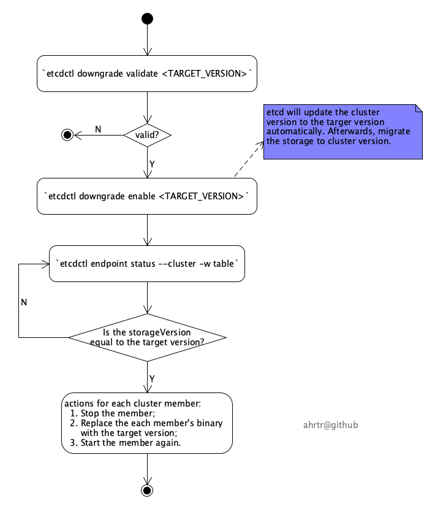

What's new in etcd 3.6? 
======
<span style="color: #808080; font-family: Babas; font-size: 1em;">
ahrtr@github <br>
March 14th, 2022
</span>

# Background
Although etcd 3.6.0 isn't released yet, basically all new features are ready, and etcd 3.6.0-alpha.0 was also available now. 
I will provide a simple summary on the major new features in this post. <br>

I implemented some new features, and reviewed the source code of all major new features. So I think I have some authority to make this summary.

Originally etcd 3.6 was planned to be integrated with K8s 1.24, but obviously it's late in K8s 1.24 release cycle. So Most likely
etcd 3.6 will be integrated with K8s 1.25.

# TL; DR
There are three major changes in 3.6,
- Almost all V2 related source code is removed.
- Support downgrading, such as 3.6 to 3.5.
- Support bootstrapping a new cluster using V3 discovery.

Let's go through them one by one.

# Removal of V2
Almost all v2 related source code has already been removed. The following two flags are gone,
```
--enable-v2 'false'
--experimental-enable-v2v3 ''
```

If you are still using client v2 to communicate with etcd server,
you must switch to client v3 before upgrading to 3.6; otherwise you will run into issue for sure. 

For example, flannel is still using client v2, so it isn't compatible with etcd 3.6. Refer to the issue [flannel/issues/1191](https://github.com/flannel-io/flannel/issues/1191).

The v2 store isn't removed yet in 3.6, and etcd will still possibly read some info from it if needed, 
see [cluster.go#L268-L269](https://github.com/etcd-io/etcd/blob/5ed7f00166b63619608b490edf8fc0e4427a5fff/server/etcdserver/api/membership/cluster.go#L268-L269).
When will the v2 store be completely removed? The answer is it will be removed when the v2 deprecation phase comes to `V2_DEPR_2_GONE` below. It isn't clear what's the exact etcd version, 
but I believe it will be definitely >= 3.7.
```
const (
	// No longer supported in v3.6
	V2_DEPR_0_NOT_YET = V2DeprecationEnum("not-yet")
	// Default in v3.6.  Meaningful v2 state is not allowed.
	// The V2 files are maintained for v3.5 rollback.
	V2_DEPR_1_WRITE_ONLY = V2DeprecationEnum("write-only")
	// V2store is WIPED if found !!!
	V2_DEPR_1_WRITE_ONLY_DROP = V2DeprecationEnum("write-only-drop-data")
	// V2store is neither written nor read. Usage of this configuration is blocking
	// ability to rollback to etcd v3.5.
	V2_DEPR_2_GONE = V2DeprecationEnum("gone")

	V2_DEPR_DEFAULT = V2_DEPR_1_WRITE_ONLY
)
```

The other point is that the client v2 isn't removed from 3.6 either, because v2 discovery depends on client v2. 
Note that v2 discovery will not be removed until etcd 3.8 based on current plan.

Refer to [etcd/issues/12913](https://github.com/etcd-io/etcd/issues/12913) to get more detailed info.

# Downgrading
etcd 3.6 is the first release which supports downgrading etcd by one minor version, such as from 3.6 to 3.5. The diagram below describes the downgrade workflow,



The workflow is straightforward, but one important point is users can't replace the binary until each member's storage version is equal to the target version. 
When they are equal, it means that the servers are ready to be downgraded.

Users can cancel the downgrade when it's in progress. If no any member was downgraded yet, then the cluster version will 
return to the original value, which is the minimum member version. Afterwards, the storage version will be automatically rolled back as well.
If at least one member was already downgraded, then users need to upgrade them back.

The overall design document is [here](https://docs.google.com/document/d/1yD0GDkxqWBPAax6jLZ97clwAz2Gp0Gux6xaTrtJ6wHE/edit). A couple of key points:
1. etcd can't start on data created by higher versions any longer starting from 3.6. For example, etcd 3.6 can't start on data generated by 3.7;
2. Storage version is introduced and persisted in the backend DB file. 
3. The DB file should contain and only contain all fields that are used by matching storage version. It means that etcd needs to remove all the new fields introduced in new versions when downgrading an etcd cluster.
4. It's developers' responsibility to add migration code for any new fields when which being added in each new etcd release. Refer to [schema.go#L136](https://github.com/etcd-io/etcd/blob/5ed7f00166b63619608b490edf8fc0e4427a5fff/server/storage/schema/schema.go#L136).

Please refer to [etcd/issues/13168](https://github.com/etcd-io/etcd/issues/13168) to get full context on this big feature.

# V3 discovery
The overall workflow of V3 discovery is similar to [v2 discovery](https://etcd.io/docs/v3.5/dev-internal/discovery_protocol/), 
but it depends on client v3 instead of client v2.

Assuming the etcd cluster supporting the discovery service is already running and one of the endpoints is `http://example.com:2379`, the rough protocol workflow to bootstrap a new etcd cluster is described below,
1. Generate a unique token to identify the new cluster. An easy way to do this is to use `uuidgen`,

```
UUID=$(uuidgen)
```
2. Specify the expected cluster size. The size is used by the discovery service to known when it has found all members that will initially form the cluster.

```
etcdctl --endpoints=http://example.com:2379 put /_etcd/registry/${UUID}/_config/size ${cluster_size}
```
3. Add the following two flags for all etcd members, and then bring up all of them,

```
--discovery-token ${UUID}
--discovery-endpoints <list of endpoints of the etcd cluster supporting the discovery service>
```

If the discovery service enables client cert authentication, configure the following flags appropriately as well. 
They follow exactly the same usage as etcdctl communicating with an etcd cluster.

```
--discovery-insecure-transport
--discovery-insecure-skip-tls-verify
--discovery-cert
--discovery-key
--discovery-cacert
```

If the discovery service enables role based authentication, configure the following flags appropriately as well. 
They follow exactly the same usage as etcdctl communicating with an etcd cluster.

```
--discovery-user
--discovery-password
```

The default time or timeout values can also be changed using the following flags, 
which also follow exactly the same usage as etcdctl communicating with an etcd cluster.

```
--discovery-dial-timeout
--discovery-request-timeout
--discovery-keepalive-time
--discovery-keepalive-timeout
```

All the flags related to v3 discovery and the equivalent etcdctl flags are summarized in the following table,

| V3 discovery flag | Description | Default value | Equivalent etcdctl flag |
|----------|:-------------:|:------:|:------:|
| --discovery-token | V3 discovery: discovery token for the etcd cluster to be bootstrapped | "" | N/A |
| --discovery-endpoints | V3 discovery: List of gRPC endpoints of the discovery service | "" | --endpoints |
| --discovery-insecure-transport | V3 discovery: disable transport security for client connections | true | --insecure-transport |
| --discovery-insecure-skip-tls-verify | V3 discovery: skip server certificate verification (CAUTION: this option should be enabled only for testing purposes) | false | --insecure-skip-tls-verify |
| --discovery-cert | V3 discovery: identify secure client using this TLS certificate file | "" | --cert |
| --discovery-key | V3 discovery: identify secure client using this TLS key file | "" | --key |
| --discovery-cacert | V3 discovery: verify certificates of TLS-enabled secure servers using this CA bundle | "" |  --cacert |
| --discovery-user | V3 discovery: username[:password] for authentication (prompt if password is not supplied) | "" | --user |
| --discovery-password | V3 discovery: password for authentication (if this option is used, --user option shouldn't include password) | "" | --password |
| --discovery-dial-timeout | V3 discovery: dial timeout for client connections | 2s | --dial-timeout |
| --discovery-request-timeout | V3 discovery: timeout for discovery requests (excluding dial timeout) | 5s | --command-timeout | 
| --discovery-keepalive-time | V3 discovery: keepalive time for client connections | 2s | --keepalive-time |
| --discovery-keepalive-timeout | V3 discovery: keepalive timeout for client connections | 6s | --keepalive-timeout |

When each etcd member gets started, it registers itself into the new cluster as a member. The equivalent etcdctl command is something like below. 
The ${member_id} is automatically calculated based on its peerURLs and the flag `--initial-cluster-token`.

```
etcdctl --endpoints=http://example.com:2379 put /_etcd/registry/${UUID}/members/${member_id} ${member_name}=${member_peer_url_1}&${member_name}=${member_peer_url_2}
```

After each member successfully registers itself, it watches the key prefix `/_etcd/registry/${UUID}/members`. 
It keeps waiting until all members finish the registration process. The equivalent etcdctl command is something like below,

```
etcdctl --endpoints=http://example.com:2379 watch /_etcd/registry/${UUID}/members --prefix
```

If you are interested the detailed implementation, take a look at [v3discovery/discovery.go](https://github.com/etcd-io/etcd/blob/main/server/etcdserver/api/v3discovery/discovery.go). 
Refer to [etcd/issues/13624](https://github.com/etcd-io/etcd/issues/13624) to get full context on this feature. 

Don't be surprised if you see that the official 3.6 document for this feature (not available yet at the moment) is very close to this post, because I am the author of the document as well.

# What else?
The complete changes in 3.6 are documented in [3.6 changelog](https://github.com/etcd-io/etcd/blob/main/CHANGELOG/CHANGELOG-3.6.md). 

There are two breaking changes in 3.6. The first one is etcd will no longer start on data created by newer version. 
I already mentioned this in above section [Downgrading](#Downgrading). 

The second break change is etcd doesn't support serving client requests on the peer listening endpoints (`--listen-peer-urls`). 
It's well known that etcd listens on 2379 for client requests, and listens on 2380 for peer requests by default. But actually 
the port 2380 could also serve client requests, and it's definitely misleading and not correct. So I fixed it in [etcd/pull/13565](https://github.com/etcd-io/etcd/pull/13565).

Another change worth mentioning is the enhancement for the health check endpoint `/health`. Previously it only supports linearizable request, 
which means that it checks the cluster's health instead of the member's health. I added one parameter `serializable` to the endpoint. 
The request `/health?serializable=true` will perform a serializable request, which means it only checks current member's health. The fix 
was also cherry-picked to 3.5, and will be included in 3.5.3.

Please read the 3.6 changelog (see link above) to get the full list of changes in 3.6.

Please let me (ahrtr@github) know if you have any comments or questions.
