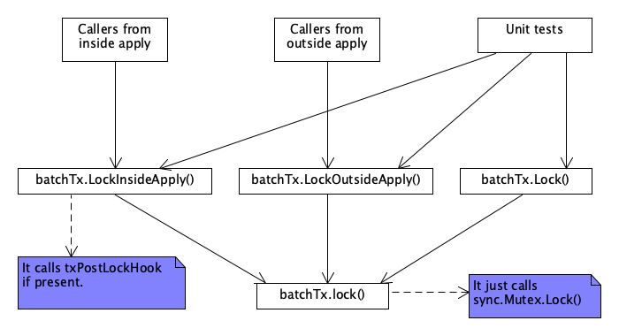

issue https://github.com/etcd-io/etcd/issues/13766
======

## Background
It's a regression introduced in [pull/12855](https://github.com/etcd-io/etcd/pull/12855), 
and all the existing etcd 3.5.x releases (including 3.5.0, 3.5.1 and 3.5.2) have this issue. 

etcd 3.4 and 3.3 do not have this issue, but there is a different [data corruption issue](https://github.com/etcd-io/etcd/issues/11651),
which was resolved in 3.3.21, 3.4.8 and 3.5.0.

## Current status
The issue [13766](https://github.com/etcd-io/etcd/issues/13766) has already been resolved in 
[pull/13854](https://github.com/etcd-io/etcd/pull/13854) for main(3.6.0) and 
[pull/13908](https://github.com/etcd-io/etcd/pull/13908) for release-3.5(3.5.3).

## Root cause
In short, the root cause is the atomicity of an applying workflow is broken, accordingly the 
data might be partially committed/persisted. If etcd crashes for whatever reason right after 
the partial commit, then it runs into the data inconsistent issue. 

Please refer to the discussion in [pull/13844](https://github.com/etcd-io/etcd/pull/13844), 
[pull/13854](https://github.com/etcd-io/etcd/pull/13854) and [issues/13766](https://github.com/etcd-io/etcd/issues/13766), 
especially the following highlighted comments,
- [13766#issuecomment-1079843692](https://github.com/etcd-io/etcd/issues/13766#issuecomment-1079843692)
- [13766#issuecomment-1080632932](https://github.com/etcd-io/etcd/issues/13766#issuecomment-1080632932)
- [13844#issuecomment-1081682316](https://github.com/etcd-io/etcd/pull/13844#issuecomment-1081682316)
- [13844#issuecomment-1081696088](https://github.com/etcd-io/etcd/pull/13844#issuecomment-1081696088)

## How to reproduce this issue
Run load test on an etcd cluster, and in the meanwhile occasionally kill the members. 
It's important to have a powerful machine (especially a fast disk, i.e. SSD). Please 
take a look at [13766#issuecomment-1078897588](https://github.com/etcd-io/etcd/issues/13766#issuecomment-1078897588).

Please note that the flag `--experimental-initial-corrupt-check` might not defect the data inconsistent issue, because 
the current implementation has flaw. etcd only compares the two members' data when they have the same revision, but when 
this issue is reproduced, usually they have different revisions. So run command `etcdctl endpoint status -w json` and compare 
the revisions, see example below,

```

$ etcdctl endpoint status -w json --cluster | jq
[
  {
    "Endpoint": "http://127.0.0.1:2379",
    "Status": {
      "header": {
        "cluster_id": 17237436991929494000,
        "member_id": 9372538179322590000,
        "revision": 6,
        "raft_term": 3
      },
      "version": "3.5.2",
      "dbSize": 24576,
      "leader": 10501334649042878000,
      "raftIndex": 17,
      "raftTerm": 3,
      "raftAppliedIndex": 17,
      "dbSizeInUse": 24576
    }
  },
  {
    "Endpoint": "http://127.0.0.1:22379",
    "Status": {
      "header": {
        "cluster_id": 17237436991929494000,
        "member_id": 10501334649042878000,
        "revision": 6,
        "raft_term": 3
      },
      "version": "3.5.2",
      "dbSize": 24576,
      "leader": 10501334649042878000,
      "raftIndex": 17,
      "raftTerm": 3,
      "raftAppliedIndex": 17,
      "dbSizeInUse": 24576
    }
  },
  {
    "Endpoint": "http://127.0.0.1:32379",
    "Status": {
      "header": {
        "cluster_id": 17237436991929494000,
        "member_id": 18249187646912140000,
        "revision": 6,
        "raft_term": 3
      },
      "version": "3.5.2",
      "dbSize": 24576,
      "leader": 10501334649042878000,
      "raftIndex": 17,
      "raftTerm": 3,
      "raftAppliedIndex": 17,
      "dbSizeInUse": 24576
    }
  }
]
```

## How is the issue resolved?
There are four proposals (that's all I can think of, please let me know if you have a better one), please 
refer to [13854#discussion_r840127417](https://github.com/etcd-io/etcd/pull/13854#discussion_r840127417).

Eventually I resolved the issue per the first proposal. Each apply workflow will be an atomic operation.
Specifically I added two methods (LockInsideApply and LockOutsideApply) into BatchTx, 
see below diagram, refer to [13854#issuecomment-1089856121](https://github.com/etcd-io/etcd/pull/13854#issuecomment-1089856121) as well.


Please note that @ptabor tried the second proposal in [pull/13878](https://github.com/etcd-io/etcd/pull/13878), but 
eventually gave up for now, reasons:
- It needs huge change on etcdserver, accordingly it may have big impact;
- The above PR is just the first step, big refactoring is still needed on top the change;
- It's difficult & risky to backport the changes to release-3.5, so definitely not acceptable.

We may consider finishing the second proposal in 3.7.

## When 3.5.3 can be ready?
Please refer to [Plans for v3.5.3 release](https://github.com/etcd-io/etcd/issues/13894). 

Previously the etcd 3.5.2 was released (on Feb 1st, 2022) about 56 days later after 
[Plans for v3.5.2 release](https://github.com/etcd-io/etcd/issues/13518) was published (on Dec 6th, 2021). 

I am not sure the exact date when 3.5.3 can be released, but the duration should be shorter because all cloud providers 
are waiting for it. So the rough estimation (just personally) is about 3~4 weeks starting from today (April 10th, 2022).
